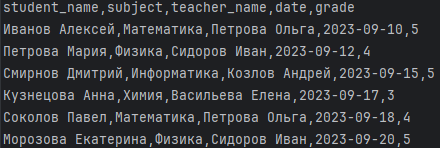
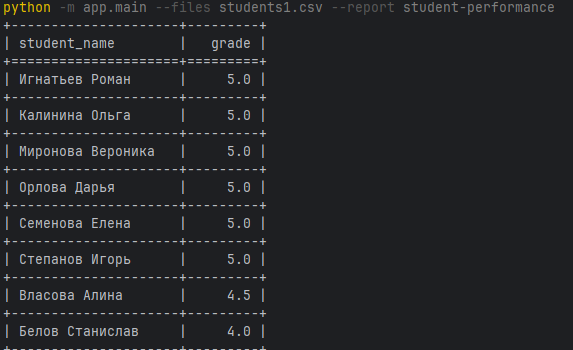

# Анализ успеваемости студентов

## Содержание
- [Описание](#описание) 
- [Как использовать](#как-использовать)
- [Запуск тестов](#запуск-тестов)

## Описание
Скрипт для обработки csv-файла. Такого формата:
<h1 align="left"></h1>
<h1 align="left"></h1>

## Как использовать
python -m "путь к main" --files "путь к файлам через пробел" --report "название отчета"

```python -m app.main --files students1.csv --report student-performance```

```python -m app.main --files students1.csv students2.csv --report student-performance```


```python -m app.main --help```


## Запуск тестов
Сначала установить зависимости:

```pip install -r requirements.txt```

После ввести:

```pytest```

